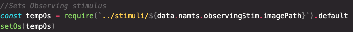
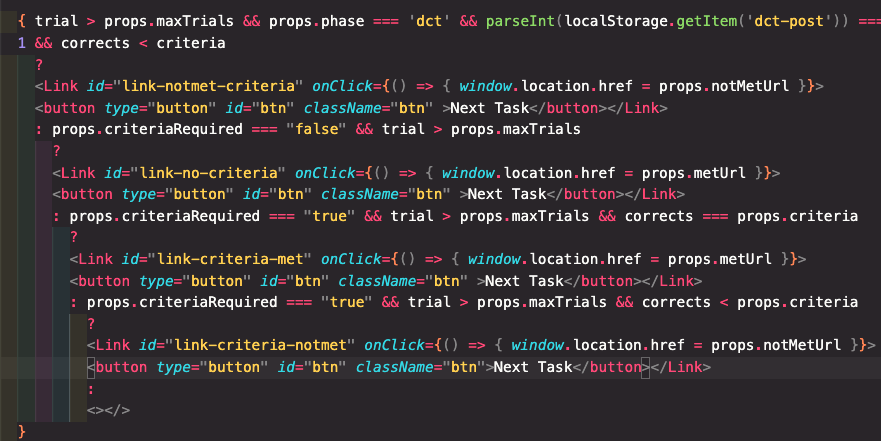
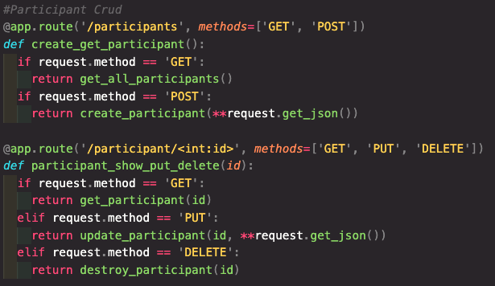
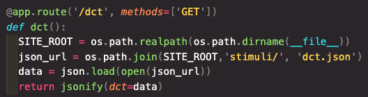
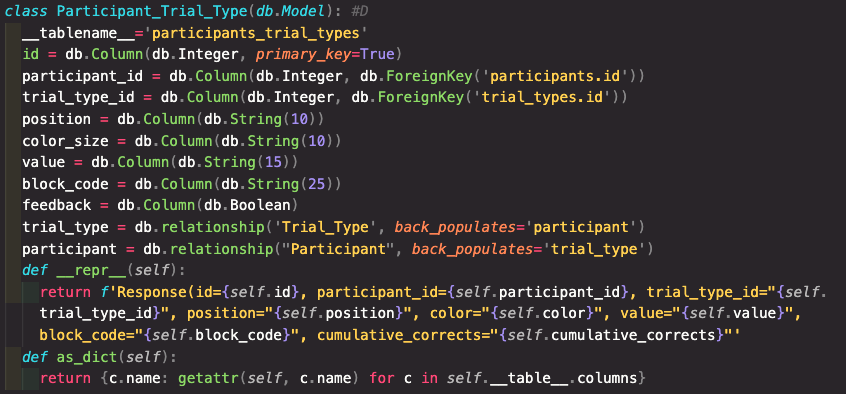
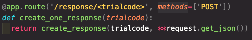
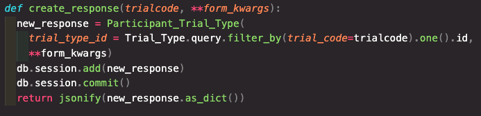

## ASDDC (Automated Stimulus Display and Data Collection)
This is the work-in-progress of an application that will be used in experimental research for a doctoral dissertation studying human behavior, learning, and complex problem solving. When it comes to learning, the automation of stimulus delivery and performance calculations can help improve learning by increasing the speed of delivery of information, calculation of performance, and decision making to move a learner along based on their in-the-moment performance. In research, the accuracy of calculations is improved, maintains consistency across participants, and collects data immediately as behavior occurs. 

### Link to the Front-End
https://github.com/smashflashtech/ASDDC-frontend
### Link to Back-End
https://github.com/smashflashtech/ASDDC-backend

## Motivation
I believe that research in Behavior Analysis can greatly benefit from taking advantage of the technology that is available for use in research. Not only does it increase the speed an accuracy of the research itself, but it also informs us of how technology can be use to improve the everyday lives of those being studied. The thing about creating software for a study is that if you don't know how to do it yourself, you have to be able to communicate your needs to a web developer and so so clearly--hoping nothing gets lost in translation (and that what you measure is actually correct). I was and am motivated to learn about the key requirements in communicating effectively and the details of what is really required to build an application. With that knowledge I can go on to create apps for future research and help others bridge the gap between researchers and developers.

## Technologies Used
React
SqlAlchemy
Flask
Postgres
HTML
Javascript
CSS

##### Screenshot(s) 

## ERD, Wireframe, & User Stories
### Researcher
*	As a user, I will be able to create new participants.
*	As a user, I will be able to use a URL constructor to generate a URL pattern to provide each participant (containing pertinent participant information). 
*	As a user, I will view a dashboard that summarizes all the experimental groups and their associated modules.
*	As a user I will see on the dashboard a description next to each module and an active link to that module page. 
*	As a user I will be able to access and test all modules as participant 1.
*	As a user I want to search for raw data for a specific participant, dyad pair, experimental group and view the search results on a table.
STRETCH: As a used I would like to export search results to an excel spreadsheet.

### Participant
*	As a user I will access ASSDC via a URL provided to me. 
*	As a user I will be led through a module sequence based on my assigned experimental group and task performance. 
*	As a user, during each module I will be presented with instructions and task trails.
*	As a user, on each trial, I will observe visible stimuli and respond by clicking on stimuli or typing a response into the input field. 
*	As a user, on trials that include feedback I will see either a black screen following incorrect responses or a firework display. 
*	As a user, on trials the exclude feedback I will see a gray screen.

### ERD

### Wireframe

## Code Snippets
### Front-End

### Back-End

## Credits
* Brock Whitbread-Cole for the ongoing support and the vote of confidence that I could take on a new stack and pursue this undertaking.
* Michael Petty for all the essential lesson in python and database design. This project really made all those tidbits come together.
* Stack overflow and all its users for the many answers I found deep in the stack.
* Struggle Bus fam for all the laughs from start to finish, early mornings, and late nights. Everything is better with friends and colleagues. 

## Future Development
Future iterations will include:
* Differential feedback (gray screen, black screen, js confetti)
* Full screen request/Auto full screen
* Sound input recording
* Sound stimulus presentation
* Stimulus delivery and data collection for EVOT and PSVOT Groups
